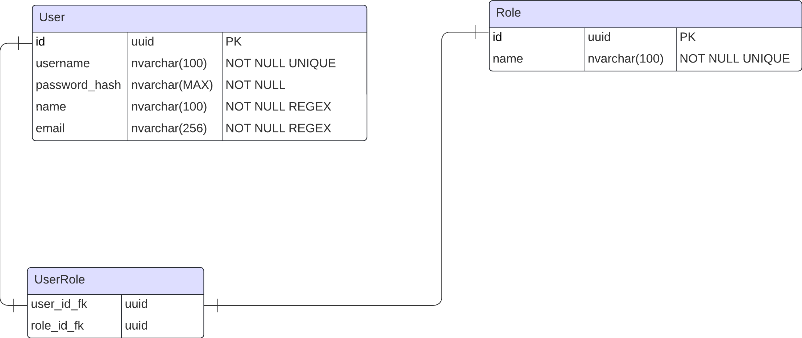

# Marquee Rental Service Web Application

Web application for a marquee rental service company.  Developed for internal use to streamline operations for company workers within different departments and workflows.

## Implementation

The implementation of the application has been separated into two main headings, development and deployment.

### Development

|Layer|Technologies|Dependencies|
|---|---|---|
|Frontend|React, Vite |Tailwind, ShadCN|
|Backend|ASP.NET Core|Entity Framework, Swagger|
|Database|Microsoft SQL Server, Docker||

### Deployment

The web application is hosted by Vercel and is accessible [here](https://marquee-company.vercel.app).

## Features

The system includes a variety of features designed to streamline operations for company workers. Each feature corresponds to a department or major workflow within the company and consists of multiple sub-features, referred to as functionalities. These functionalities are tailored to support specific tasks within the broader feature. Each listed feature is detailed in their respective sections below. Features currently being implemented or already implemented include:

- [ ] Authentication and Authorization (AA)
- [ ] Inventory Management System (IMS)

### Authenication and Authorization

The Authentication and Authorization features enables the use of role-based authentication and claim-based authentication to restrict access to certain features and resources. The following features entail details on how authorization has been utilized specificallty in the respective feature. The roles have been developed using *the principle of least prielege*. The table below lists the currently available roles, the respective feature they relate to, and a description of the permission given to each role.

|Role|Feature|Description|
|---|---|---|
|Admin|Global|Posseses all permissions within the system, including administrative and configuration capabilites.|
|Role Manager|AA|Posseses permissions to manage roles, including adding and removing roles, as well as managing permissions given to roles.|
|User Manager|AA|Posseses permissions to manage users and their roles, including adding, removing, and updating users, whilst also managing users' roles.|
|Inventory Manager|IMS|Posseses all permissions given within the inventory management system. Including adding, editing, deleting inventory items, and modyfying the list of items.|
|Inventory Worker|IMS|Posseses the minimal required permissions to perform daily inventory tasks, such as updating stock levels and recording transactions.|
|Inventory Viewer|IMS| Posseses read-only permissions, allowing them to view inventory data without making any changes.|

<!--- FOR REMEMBRANCE
> [!NOTE]
> Useful information that users should know, even when skimming content. 
-->

#### AA Functionalities

|Name|Purpose|Description|
|---|---|---|
|Login|Allows for the authentication of users.|The user is required to log in when accessing the internal pages.|
|Authorized routing|Restricts access to certain functionalities by restricting page access to certain roles and claims.|The user is required to posses the correct permissions to access restricted pages.|
|Tokens|Provides secure token-based authentication and authorization.|JWT (JSON Web Tokens) are used to securely transmit information between parties and verify user identities and permissions.|
|Role Dashboard|Allows the user to modify the roles within the system.|The user may add, update, and remove roles. The user may also modify a roles' permissions by modifying its claims.|
|User Dashboard|Allows the user to access the user within the system.|The user may add, update, and remove users within the system. The user may also modify a user's permissions either by modifying their roles or claims.|

#### AA Database Diagram

The database diagram relating to authentication and authorization within the application is shown below.

### Inventory management system

The inventory management system helps workers track and update the inventory. The system allows the users to update the number of items in stock, rented out, and faulty for each item available in the system. Specific users may also edit the list of items themselves, determined by their role.

#### Inventory Functionalities

- [ ] Modify item list for inventory
- [ ] Modify number or items in inventory

#### Authorization within Inventory subsystem

|Role|Feature|Description|
|---|---|---|

## Potential future features

- [ ] Booking management system
